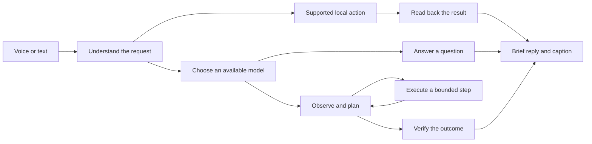

<div align="center">


# PINEBOT

### A little pineapple. A bigger kind of assistant.

**Your next interface isn't another window. It's a companion.**

Native macOS · Voice first · Quiet by design · Built toward real computer work

[The idea](#the-idea) · [What works today](#what-works-today) · [How-it-works](#how-it-works) · [The build](#the-build) · [What's-next](#whats-next)

---

</div>

## The idea

You already have the apps. You already have the accounts. You already know what you want done.

Pinebot is being built for the distance between **saying it** and **finishing it**.

It lives on your desktop as a small pineapple: awake when you need it, quieter when you don't. Hold **⌘ + ⌥** to speak. Its replies should sound like a helpful person: short, natural, and focused on the next useful action.

The destination is simple:

> “Open my browser, research this, and save the useful bits to Notes.”
>
> “Done. I saved the summary and sources.”

**That end-to-end workflow is the goal, not a claim about this version.** Pinebot is an early development build. App opening and Apple Music playback have been tested live; general browser-to-Notes work and independent subagents are still being built.

## A personality with a purpose

<table>
<tr>
<td align="center"><br /><b>Ready</b><br />Here when you need me.</td>
<td align="center"><br /><b>Thinking</b><br />Finding the next step.</td>
<td align="center"><br /><b>Working</b><br />Little hands. Real work.</td>
<td align="center"><br /><b>Sleeping</b><br />Less light. Less noise.</td>
<td align="center"><br /><b>Needs help</b><br />An honest pause.</td>
</tr>
</table>

The companion can be dragged, resized, and dimmed. Gentle motion stays inside its frame. A reduced-motion option keeps the experience calm. Speech appears in a compact caption near the top-right of the screen, then fades away.

## What works today

| Experience | Current evidence |
| :--- | :--- |
| Floating pineapple | Native AppKit panel; drag, size adjustment, sleep opacity, and emotion artwork |
| Short spoken replies | Sentence-aware speech policy, selectable English voices, and a tested voice preview |
| Speech captions | Word highlighting, bounded layout, and automatic dismissal; visibility confirmed through the app's own diagnostics |
| Open an installed app | Calculator launch verified on a real Mac |
| Control Apple Music | Real playback and pause verified; confirmation follows player-state readback |
| Account connections | ChatGPT conversation and Google Antigravity connection tested in development; Claude eligibility remains account-dependent |
| Local model routing | GLiClass ONNX integration with a private Python runtime; routing quality still needs broader evaluation |
| Computer task loop | Observation, planning, action, cancellation, and confirmation infrastructure exists; general workflows remain incomplete |
| Independent subagents | Job and desktop-lease scaffolding exists; independent worker execution is not implemented yet |
| Screen teaching | Overlay and annotation groundwork; not a finished teaching experience |

### Small commands. Small replies.

| You say | Pinebot does |
| :--- | :--- |
| “Open Calculator.” | Opens Calculator. “Opened Calculator.” |
| “Play music in Apple Music.” | Starts playback, checks the player, and names the playing track. |
| “Pause.” | Uses the recent media context and pauses Apple Music. |

Supported local commands can run without a model call. More demanding requests need an actual action-capable route; a fluent answer alone is not task completion.

## How it works



The diagram describes the intended architecture. The local-action path works for the cases above; the general action path still needs hardening and live workflow validation.

**Spend intelligence where it matters.** The router separates task intent from difficulty and checks model capabilities. A lightweight local classifier helps choose a route; it shouldn't let a greeting consume a frontier model or send a computer task to a chat-only path. That distinction is an active area of work.

**Connect through supported provider flows.** Pinebot has integrations for ChatGPT sign-in, Google Antigravity ACP, Claude Code ACP, and optional local Ollama. API keys are an advanced option. A consumer subscription is not automatically permission or entitlement to use every API or model; each integration depends on its provider's supported flow and the account's access.

**Keep the desktop under one pair of hands.** The intended agent design lets independent workers research or reason in parallel while one coordinator owns desktop input. The current coordinator tracks jobs and leases; real worker execution is a future milestone.

## The build

Pinebot uses **Swift 6**, **SwiftUI**, and **AppKit**, targeting **macOS 14 or later**. Speech uses Apple's speech frameworks. Provider agents communicate over **Agent Client Protocol (ACP)**. The optional learned router uses **GLiClass via ONNX**.

```text
Sources/
├── PinebotApp/              Application entry and native windows
└── PinebotKit/
    ├── Intent/             Action versus conversation
    ├── Capabilities/       Direct local actions and result readback
    ├── Router/             Local classification and model selection
    ├── Providers/          Provider connections
    ├── ACP/                Agent sessions and transport
    ├── TaskEngine/         Observe → plan → act
    ├── Agent/              Job and desktop-lease coordination
    ├── Screen/             Capture, observations, and overlays
    ├── Speech/             Recording and speech presentation
    └── UI/                 Companion, captions, and settings
Tests/PinebotKitTests/       Regression suites
```

### Development

```sh
git clone https://github.com/naitiksinghalns-netizen/pinebot.git
cd pinebot
swift build
swift test
```

These commands build and test the Swift package. They do **not** produce a fully packaged, signed desktop app or install provider runtimes. Large model weights, downloaded vendor executables, private environments, account data, and generated app bundles are excluded from source control. Runtime manifests document the development setup; a reproducible packaging workflow remains to be added.

Some integration tests need runtime assets. Missing assets should be treated as missing prerequisites, not as proof that an integration works. Microphone, screen capture, Accessibility, and app automation access are requested by the relevant features on macOS.

### Evidence over theater

The most recent full development run completed **137 tests with zero failures**. A subsequent focused run passed **24 intent-and-speech tests**. Live checks covered Calculator launch, Apple Music playback and pause, companion visibility, and speech presentation diagnostics.

Tests protect individual behaviors. They do not establish that Pinebot can reliably complete arbitrary computer tasks.

## What's next

- [ ] Route natural, compound instructions into computer work without losing any part of the request.
- [ ] Complete the browser → research → cited summary → Notes workflow, with saved-content verification.
- [ ] Ground actions in fresh observations and correct display coordinates.
- [ ] Make cancellation reliably release every held input and stop pending work.
- [ ] Run actual bounded subagents, join their results, and serialize desktop ownership.
- [ ] Build teaching that waits for the person and supports explicit takeover.
- [ ] Evaluate routing on varied real requests, including ambiguity and follow-ups.
- [ ] Deliver reproducible packaging and validated provider runtimes.

## The promise we want to earn

Pinebot should be quiet enough to forget, useful enough to keep, and honest enough to trust.

No invented “done.” No lecture when a sentence will do. No pretend agents behind an animated face.

**A companion that follows through.**

---

<div align="center">

🍍 **Small presence. Serious intent.**

</div>
