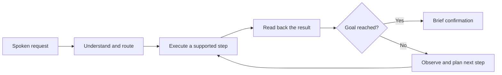

# Pinebot — from a spoken request to a verified result

> A small desktop companion with one ambition: make “do this for me” mean something.

**Platform:** macOS 14+ · **Stage:** early native prototype · **Repository:** [naitiksinghalns-netizen/pinebot](https://github.com/naitiksinghalns-netizen/pinebot)

## The problem

AI tools make it easy to get an answer. Completing a task still often means copying that answer, switching apps, and doing the remaining work yourself. Powerful models can also be unnecessarily expensive for simple commands.

Pinebot explores an interface that stays close to the work: a quiet pineapple on the desktop, activated by holding **Command + Option**. The user speaks a request; the assistant chooses a suitable route, performs supported actions, checks the result, and replies briefly.

## The experience

- **Present without demanding attention.** A movable companion with emotion artwork, sleep opacity, gentle bounded motion, and a reduced-motion option.
- **Speak naturally.** Short spoken replies and compact captions near the top-right of the screen.
- **Act before explaining.** Supported local commands execute directly and confirm through result readback.
- **Use intelligence selectively.** Separate task intent from difficulty, then route according to available model capabilities. Local commands avoid a model call.
- **Report what happened.** A successful tool invocation is only a step; the intended standard is an observable outcome.

## What has been demonstrated

| Capability | Evidence and limit |
| --- | --- |
| Desktop companion | Native floating panel, drag, resize, emotion states, and idle dimming |
| Voice presentation | Voice preview and bounded speech-caption diagnostics checked in the app |
| App launch | Calculator opened on a real Mac |
| Apple Music control | Playback and pause checked against the actual player state |
| Provider connection | ChatGPT conversation and Google Antigravity connection tested in development; access depends on the account and supported provider flow |
| Regression coverage | Published prototype checkpoint: 137 tests passed; later focused intent/speech run: 24 passed |

This is a development prototype, not a released general-purpose autonomous assistant. The repository does not include a ready-to-install signed app, private account data, downloaded provider executables, or model weights.

## Technical approach

**Swift 6, SwiftUI, and AppKit** provide the native interface. Apple's speech frameworks handle voice interaction. Provider integrations use supported authentication or **Agent Client Protocol (ACP)** flows. An optional **GLiClass ONNX** classifier supports local routing; its quality still needs broader evaluation.

The architecture separates intent recognition, local capabilities, model routing, provider sessions, computer observations, action execution, and speech presentation. The intended computer loop is:

This diagram is the architectural direction. The demonstrated local actions are narrower than the full loop.

## What makes the approach interesting

The mascot is the interface, but the deeper experiment is **verified action with a small attention and token budget**. Native local actions, capability-aware routing, concise speech, and a low-distraction presence aim to work together. A more expensive model should be used when its reasoning or tools are needed, not merely because it is available.

The planned agent architecture also separates parallel reasoning from desktop control: independent workers may research or reason, while one coordinator owns input. This prevents multiple agents from competing over the same mouse and keyboard. Independent worker execution is not yet a verified capability of the public prototype.

## Next milestones

1. Finish a bounded research workflow: open the browser, retrieve public sources, produce a cited summary, create one Apple Notes entry, and verify the saved content.
2. Validate cancellation around external actions, including uncertain outcomes where a write may already have occurred.
3. Ground computer actions in fresh observations and test real multi-step tasks.
4. Validate actual bounded workers and serialized desktop ownership.
5. Evaluate model routing, then add reproducible packaging and provider-runtime setup.

Newer research and Notes implementation work remains under review. A development checkpoint passed 201 tests, but subsequent fixes need a passing regression run and live end-to-end validation before publication.

## Contribution opportunities

Pinebot offers concrete work across native interface design, accessible motion, agent orchestration, routing evaluation, speech interaction, and outcome verification. Useful contributions should include a clear success condition and evidence that the behavior meets it.

**Small presence. Serious intent. Verified results.**
